# LAB 1 - Mise en place du Lab de Sécurité Mobile (Mobexler)

**Réalisé par :** Bouanani Noussair

## Objectifs du Lab
L'objectif de ce premier TP est de mettre en place un environnement de travail sécurisé et fonctionnel pour l'analyse d'applications mobiles, incluant :
- Le démarrage de la machine virtuelle Mobexler.
- La configuration de son accès à Internet et de son réseau local.
- La création d'un point de restauration propre (Snapshot).
- La connexion avec une cible Android (téléphone physique) via ADB.

---

## Étape 1 : Importation de l'OVA
L'image OVA de Mobexler a été téléchargée et son intégrité a été vérifiée afin d'éviter toute corruption lors du téléchargement.

## Étape 2 : Configuration Réseau de la VM
Après l'importation dans l'hyperviseur (VMware/VirtualBox), nous avons configuré les deux cartes réseau nécessaires :
- **Adapter 1 (NAT)** : Pour garantir un accès stable à Internet à la machine virtuelle.
- **Adapter 2 (Host-Only)** : Pour créer un réseau isolé de laboratoire permettant à Mobexler de communiquer avec le périphérique Android.

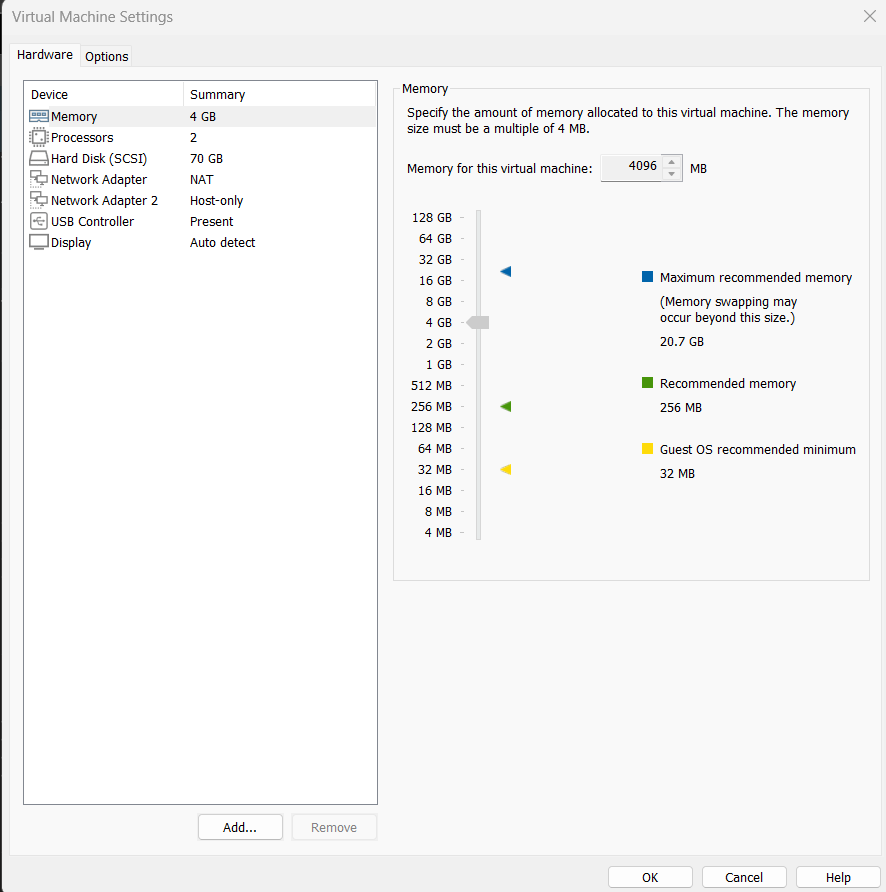

## Étape 3 : Premier Démarrage
Une fois la configuration matérielle terminée, la VM a démarré avec succès. Nous avons pu accéder à l'interface de connexion en utilisant les identifiants par défaut (`mobexler`).

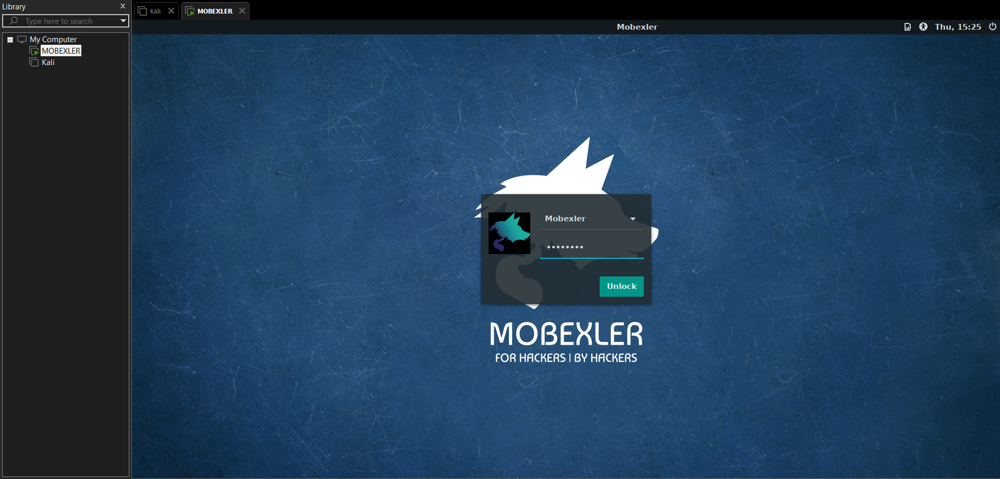

## Étape 4 : Tests de connectivité et santé du réseau
Pour valider que la configuration NAT et Host-Only est fonctionnelle, nous avons effectué plusieurs vérifications directement depuis le terminal de Mobexler.

### 1. Vérification des interfaces réseaux
L'utilisation de la commande `ip a` a permis de s'assurer que notre carte réseau a bien reçu une adresse IP (`192.168.1.133`) de l'hyperviseur.

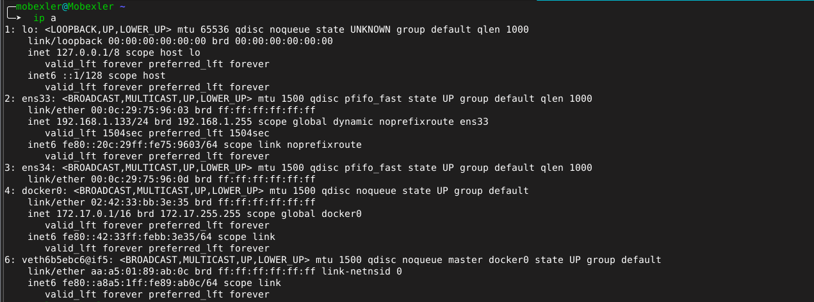

### 2. Table de routage
Nous avons vérifié la présence de la route par défaut, indispensable pour l'accès externe.

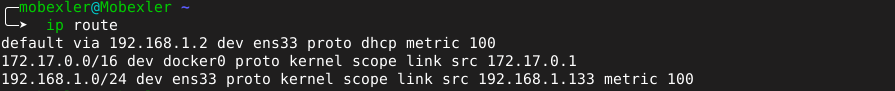

### 3. Test de résolution DNS et accès Internet
Un test de ping sur `8.8.8.8` et sur `google.com` a confirmé que l'accès internet ainsi que la résolution DNS fonctionnent parfaitement.

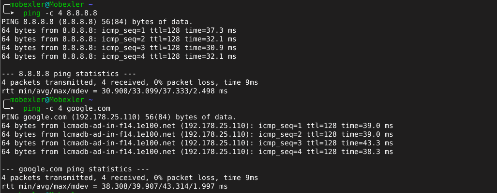

## Étape 5 : Création du Snapshot "CLEAN"
Une fois l'environnement validé comme parfaitement sain, nous avons pris un snapshot nommé `CLEAN_BASELINE_TP1`. 
Cela permet d'avoir un point de retour rapide si les prochaines manipulations (certificats, proxy, etc.) venaient à corrompre la machine.

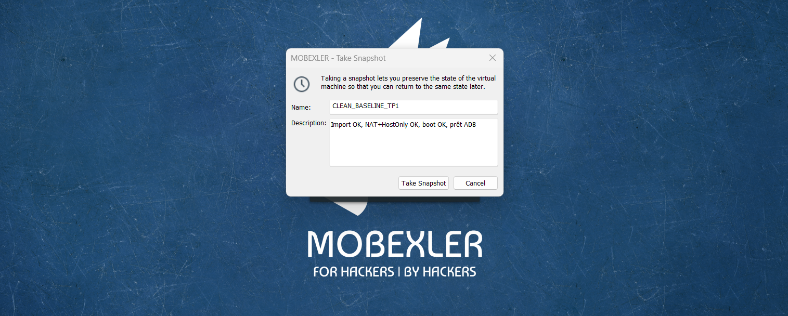

## Étape 6 : Connexion de la cible Android via ADB
Pour la dernière étape, nous avons opté pour l'**Option A** (Cible Physique).

**1. Activation des options développeur**
Nous avons tapoté plusieurs fois sur le numéro de build pour devenir développeur.

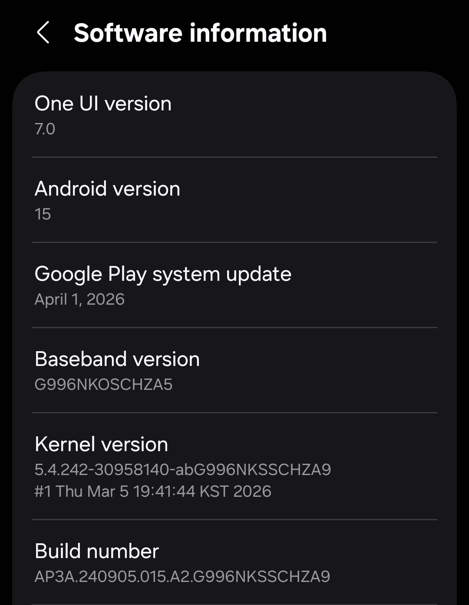

Donc l'option developer a apparu

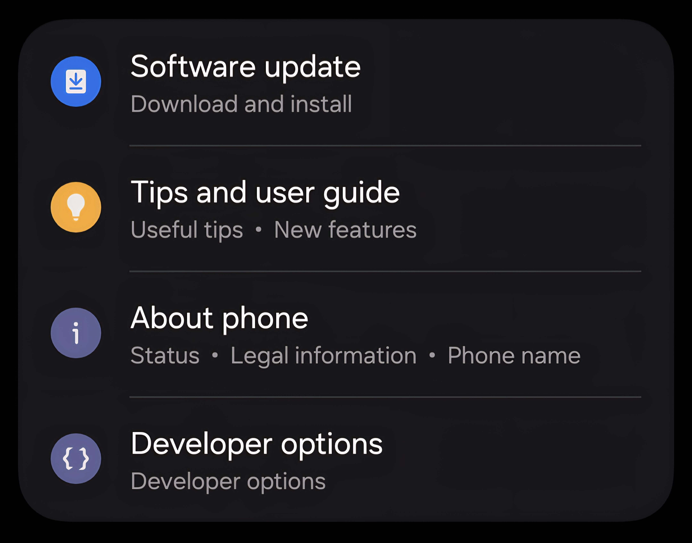

**2. Activation du débogage USB**
Dans les options pour développeur, nous avons activé le débogage USB.

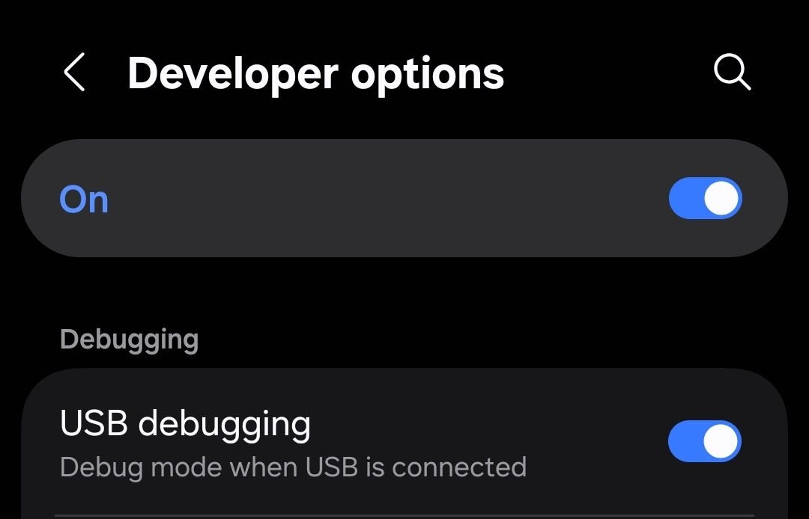

**3. Connexion à la VM**
Le téléphone a ensuite été connecté à la machine virtuelle.

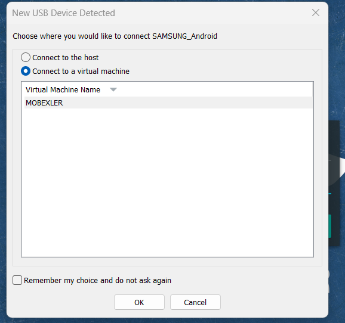

**4. Autorisation de la clé RSA**
Une demande d'autorisation est apparue sur le téléphone pour accepter la connexion ADB de la VM.

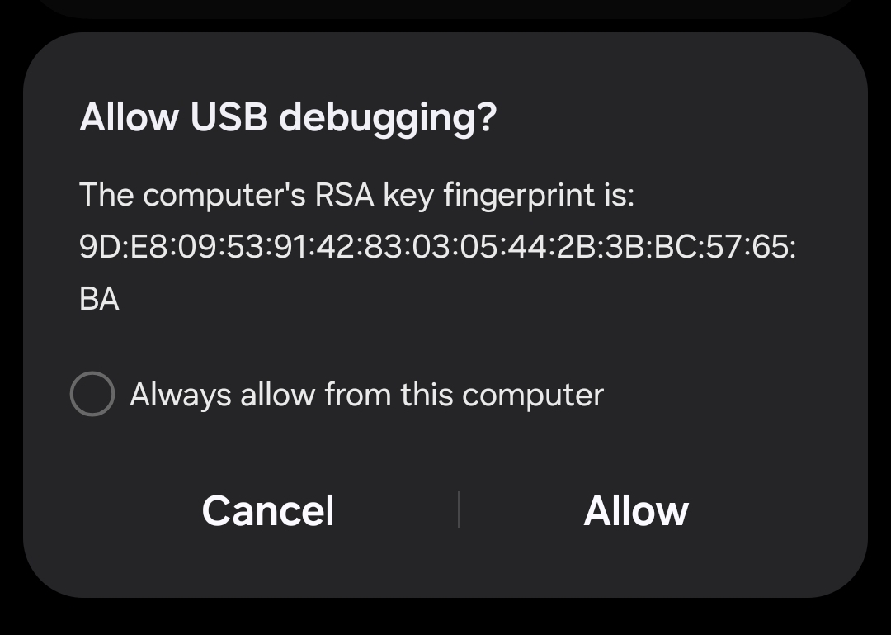

**5. Validation finale**
Enfin, la commande `adb devices` a confirmé le bon attachement du périphérique avec le statut `device`, ce qui valide entièrement ce Lab 1.

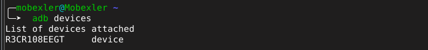
